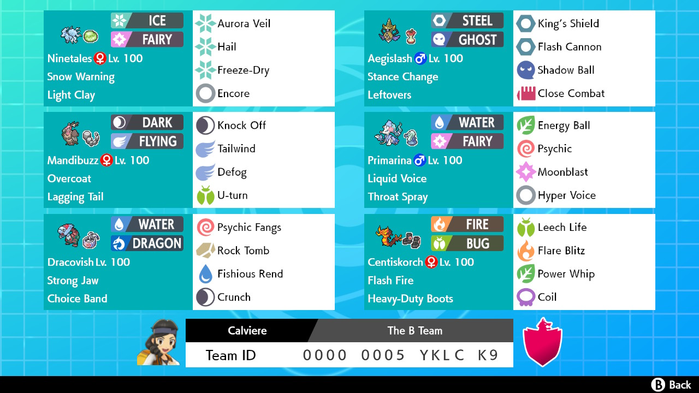

# The B Team

`0000 0005 YKLC K9` | `active`, `certified_heat`

This simple team showcases the basic principles of hyper offense as well as some less common pokemon. Normally, a hyper offense team takes advantage of fast-but-fragile hard hitters and bolsters their defense and speed as needed to avoid hits. This team takes a different approach by heaping a bunch of slow-but-bulky bruisers behind defense boosting screens, and bolstering speed when it's needed.

{.full}

You could easily upgrade a few of these pokemon and their movesets and make a decent balance team, but I think it's more valuable (and fun) to push some of these pokemon out of their comfort zone and into a faster style of play.

# Making The Team

{.left}

**Centiscorch** and **Primarina** are firmly B-tier threats, and that's being generous. Both have decent bulk, but nothing to write home about, and their Speed is attrocious... How can we let them shine?

What can we do with one sizzly boy?

## Working Out Our Core

**Centiscorch** can switch freely into the Fire attacks due to its ability: Flashfire. We can take advantage of this by pairing it with a fire-weak threat like **Aegislash**. Specially defensive **Aegislash** fits perfectly. It makes up for **Centiscorch's** poor SpDef, and acts as a special attacker for the team.

---

**Alolan-Ninetales** is another fire-weak pokemon that is notable for its ability to setup Hail and Aurora Veil. With Light Clay, Aurora Veil lasts a whopping 7 turns, doubling Defense *and* SpDef for the entire team.

**Centiscorch** and **Aegislash** pair particularly well with **Alolan-Ninetales** because they resist its quad-weakness to Steel. They also take advantage of Aurora Veil due to their already good bulk.

## I Love It When A Plan Comes Together

Our core works. Fire-Steel-Fairy complement each other defensively, and they all have good coverage options. We have no electic immunity, but Steel resists it so this is forgivable. What is *not* forgiveable is just how badly Earthquake dismantles the team. And in a world where Mold Breaker Excadrill is a real threat, Levitate won't do. We need a flyer.

---

I chose **Mandibuzz** and **Primerina** as companions. Modest Primerina threatens out dangerous Rock and Ground types, while benifitting greatly from Aurora Veil due to its generous HP. **Mandibuzz** is immune to Ground and offers the move Tailwind, which doubles the speed of our team and allowing our slow bruisers to actually outspeed things. **Mandibuzz** is also packing a Lagging Tail with U-turn, ensuring that it always switches out after the opponent makes their move. This lets us get our threats in safely, and prevents any cheeky double switches.

## Enter The... Fish?

**Dracovish** offers an additional answer to pesky Ground types, and completes a simple Dragon-Fairy-Steel type core for us. It also helps break any physical walls that prove too much for **Centiscorch**.

But that's all just gravy.

The real reason Mr. Fish here is because Tailwind lets us run a surprisingly fast Choice Band set, letting us do some horrifying damage with Fishious Rend.

---

oh, hail no

That's all folks!

**TL;DR**
Setup screens, bring thick boys, make popcorn.
